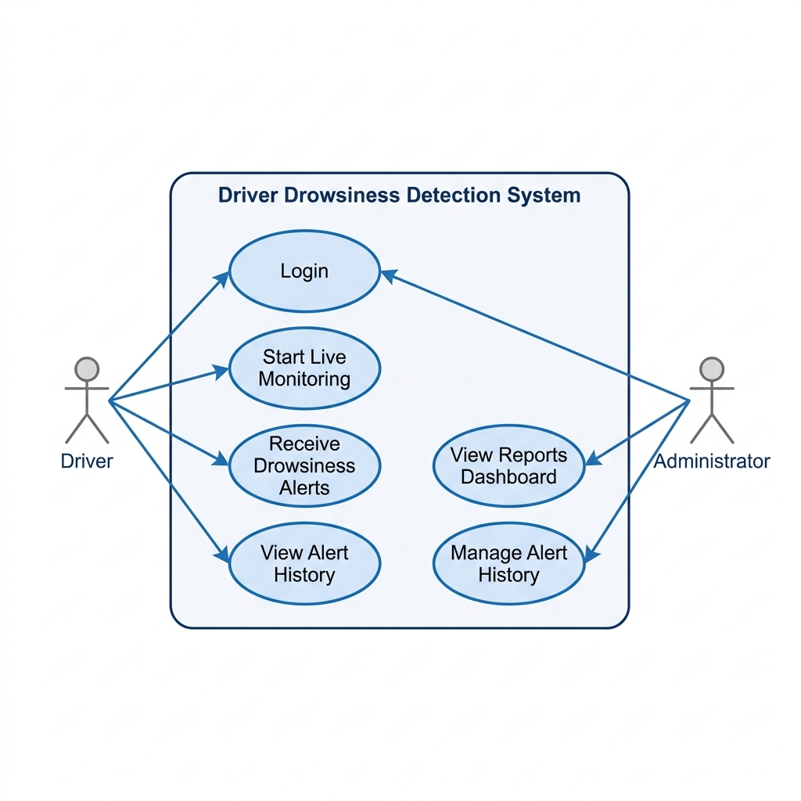
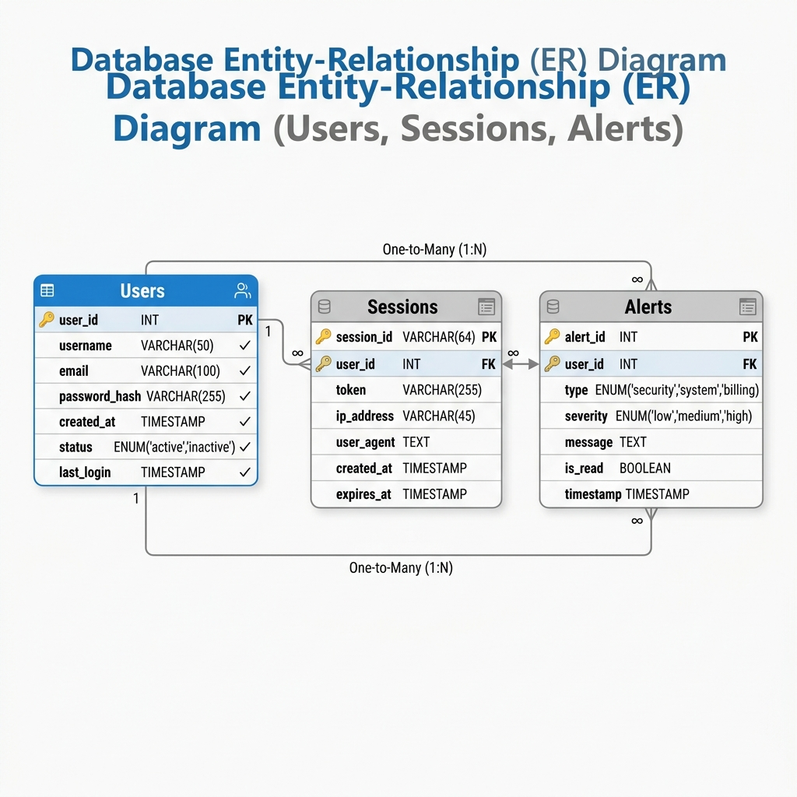
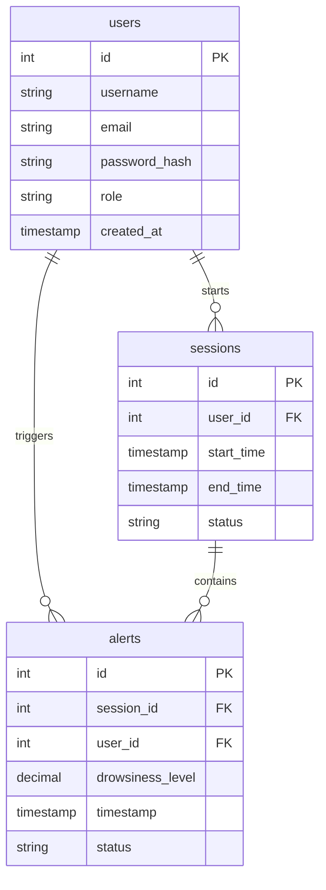
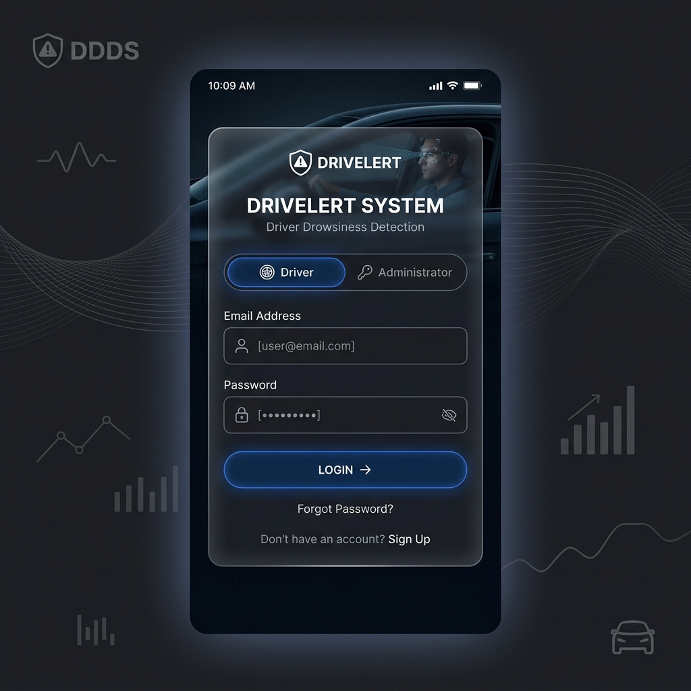
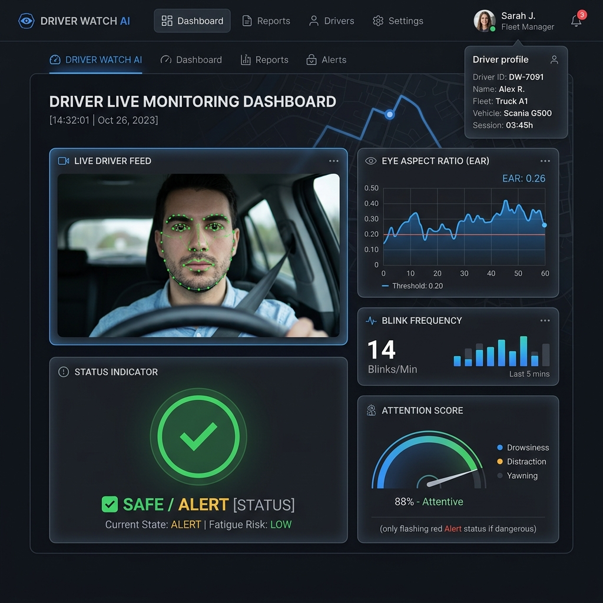
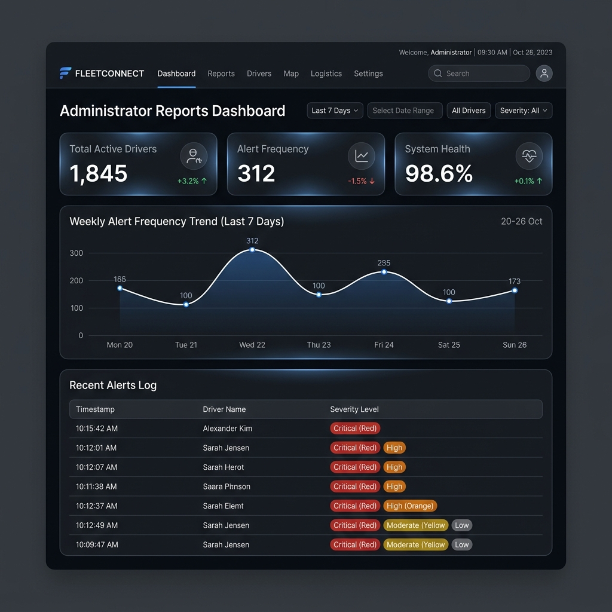

# Driver Drowsiness Detection System

## Overview

Smart Driver Drowsiness Detection System is a web-based application designed to monitor a driver's eye movements and blinking patterns to detect signs of drowsiness and alert the driver before an accident occurs.

## Problem Statement

Smart Driver fatigue is one of the major causes of road accidents worldwide. Long driving hours, insufficient sleep, and night travel can reduce concentration and reaction time.

This project aims to provide an intelligent monitoring system that can detect drowsiness and generate alerts in real time.

## Features

- User Login
- Driver Dashboard
- Live Monitoring Interface
- Blink Detection Status
- Drowsiness Detection Status
- Alert Generation
- Alert History
- Reports Dashboard

## Use Case Diagram



## System Workflow

1. Driver logs into the system.
2. Driver starts monitoring.
3. Camera captures live video.
4. Face and eyes are detected.
5. Eye blinking is monitored.
6. Drowsiness level is calculated.
7. Alert is generated when drowsiness is detected.
8. Alert history is stored.
9. Administrator can view reports and alert history.

## Basic Modules

The application is structured into the following core modules:

1. **User Authentication Module**: 
   - Handles registration, authentication, and secure login for both drivers and administrators.
   
2. **Video Capture & Pre-processing Module**: 
   - Interfaces with the webcam to capture real-time video frames and normalizes them for facial landmarks detection.
   
3. **Drowsiness Detection Module**: 
   - Uses eye aspect ratio (EAR) algorithms to determine blink patterns, eye closure duration, and drowsiness levels.
   
4. **Real-time Alerting Module**: 
   - Triggers prompt audio alarms and visual warning overlays when the drowsiness threshold is exceeded.
   
5. **Alert Logger & History Module**: 
   - Persists all triggered alerts and session stats into the database.
   
6. **Admin Dashboard & Reporting Module**: 
   - Generates summary reports, charts, and alert frequency graphs to monitor driver safety and behavioral trends.

## Database Design

### Table List

The database consists of the following key tables:

| Table Name | Description | Key Fields |
| :--- | :--- | :--- |
| **`users`** | Stores registration, credentials, and roles for drivers and administrators. | `id` (PK), `username`, `email`, `password_hash`, `role` |
| **`sessions`** | Tracks each monitoring session started by a driver. | `id` (PK), `user_id` (FK), `start_time`, `end_time`, `status` |
| **`alerts`** | Logs drowsiness alerts triggered during monitoring sessions. | `id` (PK), `session_id` (FK), `user_id` (FK), `drowsiness_level`, `timestamp`, `status` |

### ER Diagram

Both the visual diagram and Mermaid schema representation are shown below:

#### Visual ER Diagram


#### Schema Relationship Diagram


### SQL Schema

```sql
-- Create Users Table
CREATE TABLE users (
    id INT AUTO_INCREMENT PRIMARY KEY,
    username VARCHAR(50) NOT NULL UNIQUE,
    email VARCHAR(100) NOT NULL UNIQUE,
    password_hash VARCHAR(255) NOT NULL,
    role ENUM('driver', 'admin') DEFAULT 'driver',
    created_at TIMESTAMP DEFAULT CURRENT_TIMESTAMP
);

-- Create Sessions Table
CREATE TABLE sessions (
    id INT AUTO_INCREMENT PRIMARY KEY,
    user_id INT NOT NULL,
    start_time TIMESTAMP DEFAULT CURRENT_TIMESTAMP,
    end_time TIMESTAMP NULL,
    status VARCHAR(20) DEFAULT 'active',
    FOREIGN KEY (user_id) REFERENCES users(id) ON DELETE CASCADE
);

-- Create Alerts Table
CREATE TABLE alerts (
    id INT AUTO_INCREMENT PRIMARY KEY,
    session_id INT NOT NULL,
    user_id INT NOT NULL,
    drowsiness_level DECIMAL(5,2) NOT NULL,
    timestamp TIMESTAMP DEFAULT CURRENT_TIMESTAMP,
    status ENUM('alerted', 'dismissed', 'ignored') DEFAULT 'alerted',
    FOREIGN KEY (session_id) REFERENCES sessions(id) ON DELETE CASCADE,
    FOREIGN KEY (user_id) REFERENCES users(id) ON DELETE CASCADE
);
```

## UI Wireframe Design & Page Layouts

Below are the key page layouts designed for the Smart Driver Drowsiness Detection System:

### 1. Login Page Layout
A clean, centralized portal for Drivers and Administrators to authenticate.



---

### 2. Driver Live Monitoring Dashboard
The real-time interface showing webcam capture feed, real-time Eye Aspect Ratio (EAR) metric analytics, blink counter, and the current drowsiness status.



---

### 3. Administrator Reports & Analytics Dashboard
A secure dashboard for administrators to view aggregated statistics, active sessions, safety metrics, and historical logs.



## Technologies Used

- React.js
- Tailwind CSS
- JavaScript
- HTML
- CSS

## Future Enhancements

- Real-time webcam integration
- OpenCV implementation
- AI-based eye tracking
- SMS and Email alerts
- Cloud database integration
